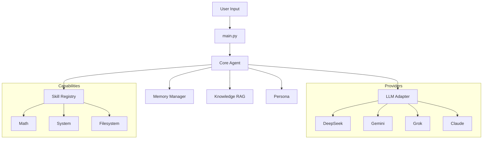

<div align="center">
  
  <h1>ADA: Python LLM Agent with Customizable Skills, Memory, Knowledge RAG & Persona</h1>
</div>

[](https://opensource.org/licenses/MIT)
[](https://www.python.org/downloads/)
[](https://github.com/psf/black)
[](http://makeapullrequest.com)

**ADA** is a lightweight, provider-agnostic framework for building AI agents with **customizable skills**, **persistent memory**, **knowledge RAG**, and **personas**. Designed for simplicity and extensibility, ADA allows you to create agents that learn, remember, and act in local environments.

---

## 🚀 Features

- **🧠 Provider Agnostic**: Seamlessly switch between **DeepSeek**, **Gemini**, **Grok**, and **Claude**.
- **📚 Dynamic Skill System**: Load tools and "skills" on the fly based on context.
- **💾 Persistent Memory**: Long-term memory management using JSON-based storage (upgradable to Vector DB).
- **🛡️ Sandbox Ready**: Primitive tools (`run_command`, `read_file`) designed for safe execution environments.
- **🔌 Extensible Architecture**: Clean adapter patterns for LLMs make adding new providers trivial.

## 📦 Installation

### Option 1: Install via Pip (Recommended)
```bash
pip install git+https://github.com/ericwang915/ada_agent.git
```

### Option 2: Clone for Development
1. **Clone the Repository**
   ```bash
   git clone https://github.com/ericwang915/ada_agent.git
   cd ada_agent
   ```

2. **Set Up Virtual Environment**
   ```bash
   python3 -m venv venv
   source venv/bin/activate
   ```

3. **Install Dependencies**
   ```bash
   pip install -e .
   ```

## Examples

The `examples/` directory contains demo scripts for different LLM providers:

*   **DeepSeek**: `examples/demo_deepseek.py`
*   **OpenAI**: `examples/demo_openai.py`
*   **Google Gemini**: `examples/demo_gemini.py`
*   **Grok (xAI)**: `examples/demo_grok.py`
*   **Multi-turn Conversation**: `examples/demo_multi_turn.py`

### Running a Demo

```bash
# Example for DeepSeek
python examples/demo_deepseek.py

# Example for OpenAI
python examples/demo_openai.py
```

The demo scripts will automatically initialize a default `context` (skills, memory, knowledge) in your current directory if one doesn't exist.

## 🛠️ Configuration

The agent requires an API key. You can provide this in two ways:

**Environment Variables** (Recommended):
```bash
export DEEPSEEK_API_KEY="sk-..."
```

## ⚡ Quick Start

Start the ADA generic agent:

```bash
ada
```

### Example Interaction

```text
You: Can you check the disk usage of my home directory?
ADA: I'll check that for you.
[Executing: df -h /Users/username]
ADA: Your home directory is using 45% of available space.
```

### Library Usage

You can use ADA as a library in your own Python projects.

```python
from ada_agent import Agent, OpenAICompatibleProvider
import os

# 1. Setup Provider
# Ensure you have the API key set in your environment

# --- Option A: DeepSeek (Default) ---
api_key = os.getenv("DEEPSEEK_API_KEY")
provider = OpenAICompatibleProvider(
    api_key=api_key,
    base_url="https://api.deepseek.com/v1",
    model_name="deepseek-chat"
)

# --- Option B: OpenAI ---
# api_key = os.getenv("OPENAI_API_KEY")
# provider = OpenAICompatibleProvider(
#     api_key=api_key,
#     base_url=None,
#     model_name="gpt-4o"
# )

# --- Option C: Google Gemini ---
# from ada_agent.core.llm.gemini_client import GeminiProvider
# api_key = os.getenv("GEMINI_API_KEY")
# provider = GeminiProvider(
#     api_key=api_key, 
#     model_name="gemini-2.0-flash-exp"
# )

# --- Option D: Grok (xAI) ---
# api_key = os.getenv("XAI_API_KEY")
# provider = OpenAICompatibleProvider(
#     api_key=api_key,
#     base_url="https://api.x.ai/v1",
#     model_name="grok-beta"
# )

# 2. Initialize Agent
# The agent will automatically use or create a './context' folder in the current directory.
# You don't need to manually create folders or pass paths unless you want to customize them.
agent = Agent(provider=provider)

# 3. Chat
response = agent.chat("What can you do?")
print(response)
```

### Multi-turn Conversation

The agent automatically maintains conversation history.

```python
# Turn 1
response = agent.chat("I'm planning a trip to Mars.")
print(response)

# Turn 2 (Agent remembers context)
response = agent.chat("How long does it take to get there?")
print(response)
```

## 📁 Customizing Your Agent

After running the agent (or initializing it), a `context/` directory is created in your project root. You can fully customize the agent by modifying this folder:

*   **`context/skills/`**: Add new capabilities.
    *   Create a new folder for your skill (e.g., `my_skill`).
    *   Add a `SKILL.md` file with instructions and tool definitions.
*   **`context/knowledge/`**: Add domain knowledge for RAG.
    *   Simply drop `.txt` or `.md` files here. The agent will index them to answer questions based on your specific documents.
*   **`context/memory/`**: Persistent memory storage.
    *   `memory.json` contains the agent's long-term recall.
*   **`context/persona/`**: Define the agent's personality.
    *   Add text files to describe who the agent is and how it should behave.

## 🧩 Architecture



## 🤝 Contributing

We welcome contributions! Please see [CONTRIBUTING.md](CONTRIBUTING.md) for details.

1. Fork the repo
2. Create your feature branch (`git checkout -b feature/amazing-feature`)
3. Commit your changes (`git commit -m 'Add some amazing feature'`)
4. Push to the branch (`git push origin feature/amazing-feature`)
5. Open a Pull Request

## 📄 License

Distributed under the MIT License. See `LICENSE` for more information.

---
*Built with ❤️ by the Open Source Community*
