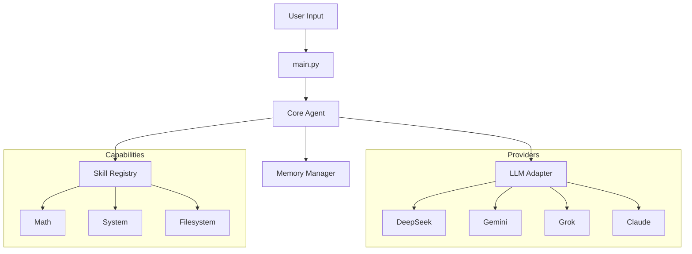

# ADA: Python LLM Agent with Customizable Skills, Memory, Knowledge RAG & Persona

[](https://opensource.org/licenses/MIT)
[](https://www.python.org/downloads/)
[](https://github.com/psf/black)
[](http://makeapullrequest.com)

**ADA** is a lightweight, provider-agnostic framework for building AI agents with **customizable skills**, **persistent memory**, **knowledge RAG**, and **personas**. Designed for simplicity and extensibility, ADA allows you to create agents that learn, remember, and act in local environments.

---

## 🚀 Features

- **🧠 Provider Agnostic**: Seamlessly switch between **DeepSeek**, **Gemini**, **Grok**, and **Claude**.
- **📚 Dynamic Skill System**: Load tools and "skills" on the fly based on context.
- **💾 Persistent Memory**: Long-term memory management using JSON-based storage (upgradable to Vector DB).
- **🛡️ Sandbox Ready**: Primitive tools (`run_command`, `read_file`) designed for safe execution environments.
- **🔌 Extensible Architecture**: Clean adapter patterns for LLMs make adding new providers trivial.

## 📦 Installation

### Option 1: Install via Pip (Recommended)
```bash
pip install git+https://github.com/ericwang915/ada_agent.git
```

### Option 2: Clone for Development
1. **Clone the Repository**
   ```bash
   git clone https://github.com/ericwang915/ada_agent.git
   cd ada_agent
   ```

2. **Set Up Virtual Environment**
   ```bash
   python3 -m venv venv
   source venv/bin/activate
   ```

3. **Install Dependencies**
   ```bash
   pip install -e .
   ```

## 🛠️ Configuration

Copy the example environment file and configure your API keys:

```bash
cp examples/.env.example .env
```

Edit `.env`:

```ini
# Choose your provider: deepseek, gemini, grok, claude
LLM_PROVIDER=deepseek

# Add keys for your chosen provider(s)
DEEPSEEK_API_KEY=sk-...
GEMINI_API_KEY=...
GROK_API_KEY=...
ANTHROPIC_API_KEY=sk-ant...
```

## ⚡ Quick Start

Start the ADA generic agent:

```bash
ada
```

### Example Interaction

```text
You: Can you check the disk usage of my home directory?
ADA: I'll check that for you.
[Executing: df -h /Users/username]
ADA: Your home directory is using 45% of available space.
```

## 💻 Library Usage

You can use ADA as a library in your own Python projects, allowing for **custom memory**, **skills**, **knowledge base**, and **persona**.

```python
from ada_agent import Agent, OpenAICompatibleProvider
import os

# 1. Setup Provider
provider = OpenAICompatibleProvider(
    api_key="sk-...",
    base_url="https://api.deepseek.com/v1",
    model_name="deepseek-chat"
)

# 2. Define Paths and Initialize if Needed
base_dir = os.path.dirname(os.path.abspath(__file__))
context_dir = os.path.join(base_dir, "context")

if not os.path.exists(context_dir):
    from ada_agent import init
    init(base_dir)

# Assumes you have these folders (created by init check above)
knowledge_path = os.path.join(context_dir, "knowledge")
memory_path = os.path.join(context_dir, "memory", "memory.json")
skills_path = os.path.join(context_dir, "skills")
persona_path = os.path.join(context_dir, "persona")

# 3. Initialize Agent with Custom Paths
agent = Agent(
    provider=provider,
    knowledge_path=knowledge_path,
    memory_path=memory_path,
    skills_dirs=[skills_path],
    persona_path=persona_path,
    verbose=True
)

# 4. Chat
response = agent.chat("What is the capital of Mars provided in the knowledge base?")
print(response)
```

## 🎬 Demos

Check the `examples/` directory for ready-to-run scripts:

1.  **Full Demo**: `examples/demo.py`
    *   Demonstrates RAG (Knowledge), Custom Memory, Skills, and Persona configuration.

## 🧩 Architecture



## 🤝 Contributing

We welcome contributions! Please see [CONTRIBUTING.md](CONTRIBUTING.md) for details.

1. Fork the repo
2. Create your feature branch (`git checkout -b feature/amazing-feature`)
3. Commit your changes (`git commit -m 'Add some amazing feature'`)
4. Push to the branch (`git push origin feature/amazing-feature`)
5. Open a Pull Request

## 📄 License

Distributed under the MIT License. See `LICENSE` for more information.

---
*Built with ❤️ by the Open Source Community*
